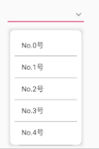
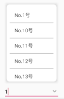

# WEditText

# [](https://jitpack.io/#wongkyunban/WEditText)

ClearEditText SimpleSpinnerEditText SpinnerEditText库

# Usage
__Step 1.__ Add the JitPack repository to your build file
Add it in your root build.gradle at the end of repositories:
```java
allprojects {
  repositories {
    ...
    maven { url 'https://jitpack.io' }
  }
}
```
__Step 2.__ Add the dependency
```java
dependencies {
  implementation 'com.github.wongkyunban:WEditText:v1.0.1'
}
```

# Detail
## ClearEditText


|API|Desc|
|--|--|
|setClearDrawable(Drawable)|set clear button image as same as setCompoundDrawables()|

We also can set drawable through attribute `android:drawableEnd` or `android:drawableRight` in xml layout.
## SimpleSpinnerEditText




|API|Desc|
|--|--|
|setPopupBackground(Drawable)|PopupWindow background|
|setPopupDivider(Drawable)|divider between items|
|setPopupDividerHeight(int)|set height of divider|
|setSelectDrawable(Drawable)|set drawable of button to select item|
|setAdapter(BaseAdapter)|set adapter to show items when clicking the button|

We also can set drawable through attribute `android:drawableEnd` or `android:drawableRight` in xml layout.

### demo:
```java
String[] strings = new String[10];
for (int i = 0; i < 10; i++) {
  strings[i] = "No." + i + "号";
  }
SimpleSpinnerEditText simpleSpinnerEditText = findViewById(R.id.sset);
BaseAdapter adapter = new ArrayAdapter<String>(this, android.R.layout.simple_list_item_1, strings);
simpleSpinnerEditText.setAdapter(adapter);
```
## SpinnerEditText
SpinnerEditText is a little from SimpleEditText.They both provide editting and selecting options.SpinnerEditText can show items which containe the characters that you are typing.




|API|Desc|
|--|--|
|setPopupBackground(Drawable)|PopupWindow background|
|setPopupDivider(Drawable)|divider between items|
|setPopupDividerHeight(int)|set height of divider|
|setSelectDrawable(Drawable)|set drawable of button to select item|
|setOptions(List<Object>)|set options|

We also can set drawable through attribute `android:drawableEnd` or `android:drawableRight` in xml layout.

### demo:
```java
SpinnerEditText spinnerEditText = findViewById(R.id.set_select_input);
List<Object> list = new ArrayList<>();
for (int i = 0; i < 50; i++) {
  list.add("No." + i + "号");
}
spinnerEditText.setOptions(list);
```
